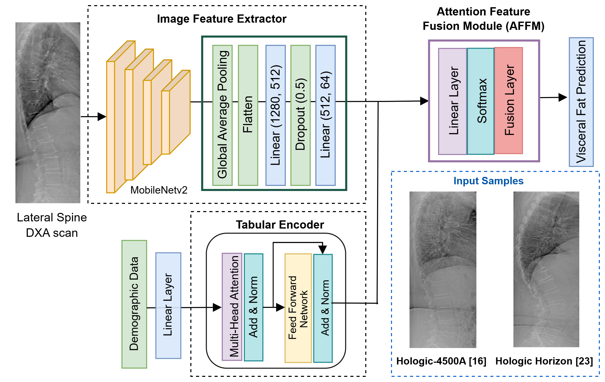

## From Pixels to Prognosis: A Multi-Modal Attention-based Framework for Visceral Adipose Tissue Estimation 
#### (Accepted at MICCAI-2025)

A PyTorch implementation of Multi-Model Attention based Model for Visceral Adipose Tissue (VAT) from Lateral Spine (LS) view Dual-energy X-ray Absorptiometry (DXA) scans.

<!--  -->

  

## Dataset
A custom dataset was used to train the model but cannot be shared due to data ethics restrictions. 
This implementation expects the dataset in a CSV file format, with the following columns:
- `image_path`: File path to the input DICOM image. 
- `label`: Ground truth value for visceral fat (in grams).
- `age`: Age of the subject (in years).  
- `weight`: Weight of the subject (in kilograms).  
- `height`: Height of the subject (in centimeters).

All input images are expected to be DICOM (.dcm) files.

## Model Implementation
The `module.ipynb` file contains the implementation to the proposed model.
